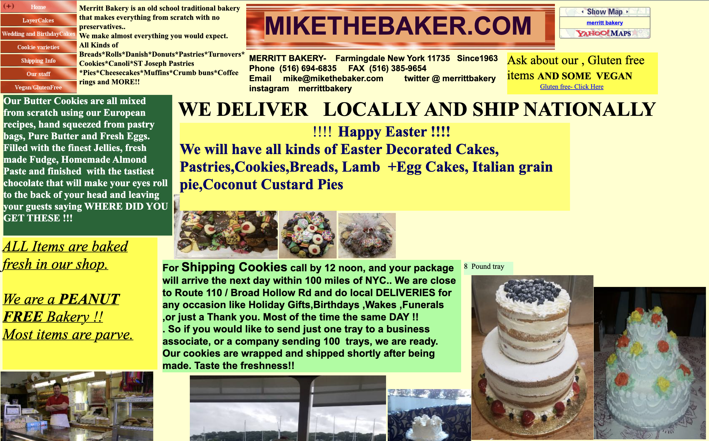

# Merritt Bakery

For a front-end based side project, I redesigned a bakery's website that had a list of problems. This is, at the moment, completely static and is meant to display design skills.

## Table of contents

- [Overview](#overview)
  - [The problem](#the-problem)
  - [Screenshots](#screenshots)
    - [Original website](#original-website)
    - [My version](#my-version)
- [Continued development](#continued-development)

## Overview

### The problem

As per the bakery's actual [website](http://www.mikethebaker.com/), there is a list of visually obvious problems. I wanted to recreate the website containing the same information provided by the business. 

### Screenshots

#### Original website

#### My version

## Continued development

I love coding on the front end and would love for this to be an example for potential freelance projects.